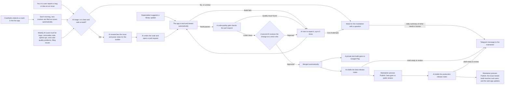

<!-- Hero banner. capsule-render takes a single hex (no #); 60A5FA is Cue Clock's
     brand blue (app accent), so the banner matches the product, not my profile purple. -->

### Time. Under Control.

<!-- Animated tagline. Space Mono on purpose: the app renders every clock/countdown
     digit in Space Mono, so the banner font echoes the product's numeric identity. -->

  
  
  
  

A minimal, distraction-free clock built for **broadcast professionals** who watch multiple timezones and run countdown timers at once. Read from across a studio; fast, obvious, and zero friction when every second counts.

---

### ⚡ What it does

|                                                                                       |                                                                                 |
| ------------------------------------------------------------------------------------- | ------------------------------------------------------------------------------- |
| 🕒 **Dual Timezone Clocks:** side-by-side live clocks across 18 broadcast timezones. | ⏳ **Infinite Countdowns:** as many named timers as you need, tied to any zone. |
| 📐 **Deduction Offsets:** auto-subtract pre-show buffers from targets.               | ✅ **Passed Cues:** fired countdowns collapse into compact strips.              |
| 🔔 **Alerts & Alarms:** a notification, or a full-screen alarm that wakes the device (Android). | 🔊 **Final 3-Second Beep:** audio ticks at T−3/−2/−1 and a "go" tone at zero. |
| 🎬 **On-Air Mode:** a full-screen studio display with every control stripped away.   | 📱 **Native Everywhere:** iOS, Android & Web from one codebase, offline-first.  |

---

### 🤖 It largely runs itself

This repo is a working demo of an **autonomous software pipeline**. AI workflows triage issues, research them, write the code, review it as a strict critic, and draft releases; a human only presses the final **Publish**. The AI workflows that run it:

<!-- AI-SCOREBOARD:START -->

**📊 AI Evals.** The automation is measured, not just trusted. Score is a 0-100 health mark: work merged (50%), work that needed no human rescue (30%), and low repair churn (20%). A dash means too quiet to score. Updated monthly by `.github/workflows/ai-evals.yml`.

| Period  | AI PRs opened | AI PRs merged | Auto-fix runs | Waiting on a human | Score /100 |
| ------- | ------------- | ------------- | ------------- | ------------------ | ---------- |
| 2026-07 | 7             | 4             | 17            | 2                  | 58         |

<!-- AI-SCOREBOARD:END -->

---

### 🚀 Release pipeline

Once a change is merged, shipping is automated too. These build and deploy the app to Google Play and the web:

---

### 🛠️ Built with

  
  
  
  
  
  
  
  
  

One monorepo, three products: the **app** (`app/`), the marketing **site** (`website/`), and an AI-driven **E2E test harness** (`tests/`).

> 🧑‍💻 **Want to run or self-host it?** Every setup step (install, platform builds, the test suite) lives in **[DEVELOPMENT.md](./DEVELOPMENT.md)**.

---

### 💛 Support

Cue Clock is **free, open-source, and ad-free**, and it will stay that way. I will never put ads in anything I build. If it's useful to you, a coffee funds continued development.

---

**License** · [AGPL-3.0](./LICENSE) · commercial licensing: [hello@yashura.io](mailto:hello@yashura.io)  
**Contributing** · [CONTRIBUTING.md](./CONTRIBUTING.md) · [Code of Conduct](./CODE_OF_CONDUCT.md)  
**Security** · found a vulnerability? [SECURITY.md](./SECURITY.md)

